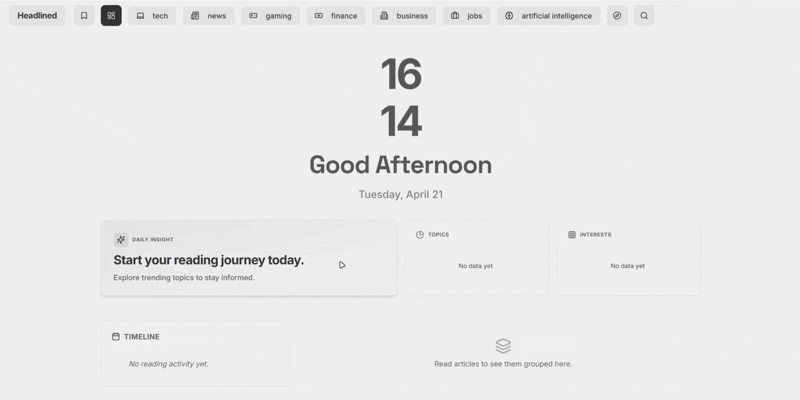
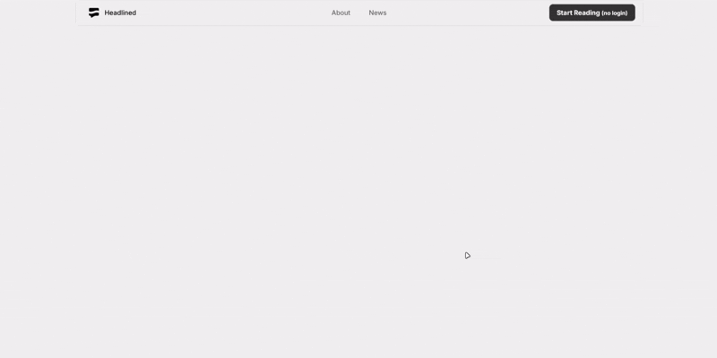
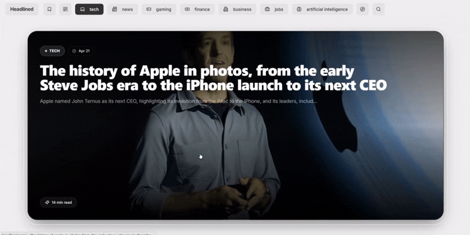
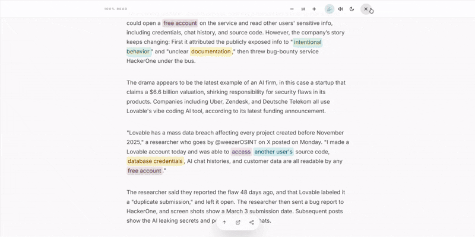

#  Headlined


A curated, ad-free news aggregator built for the modern attention span. Headlined transforms traditional, cluttered news reading into a seamless, immersive TikTok-style swiping experience.

<div align="center">
  
  <p><em>Immersive TikTok-style swiping interface built with Embla Carousel.</em></p>
</div>

### 🌟 Feature Showcase

| Topic Intelligence | AI-Enhanced Detail View |
| :---: | :---: |
|  |  |
| *Filters raw streams into personalized interest vectors.* | *AI-generated highlights and dynamic typography scaling.* |

| Discovery Dashboard |
| :---: |
|  |
| *Local-first search hub using FlexSearch and IndexedDB.* |

## 💡 The Product Philosophy

**The Problem:** Reading the news today is exhausting. It's fragmented across dozens of apps, bloated with pop-ups, and overwhelming to navigate.
**The Solution:** Headlined aggregates 15+ top-tier sources (Hacker News, Bloomberg, BBC, etc.) into a single, unified feed. By adopting a vertical-scroll UX (like TikTok/Reels), it reduces cognitive load and makes catching up on the world's events effortless and engaging.

### User-First Features
- **Immersive UX:** Full-page swipe gestures. Read the headlines instantly, swipe for the next.
- **Zero Distractions:** Stripped of ads, pop-ups, and trackers. Just the news.
- **Smart Curation:** Articles are automatically categorized into Topics (Tech, Finance, Politics) so you only see what you care about.
- **PWA Ready:** Installable on iOS/Android for a native app feel.

---

## 🛠️ The Engineering: $0 Cost Serverless Architecture

As a Product Engineer, the goal was to build a highly scalable app with **sustainable business constraints**. Instead of paying for expensive database hosting (e.g., Supabase/Firebase) to store thousands of daily articles, Headlined uses a custom "Serverless Static Pipeline".

1. **The Scraper (GitHub Actions):** A cron job spins up every 6 hours to fetch fresh RSS feeds.
2. **Smart Deduplication:** The Node.js engine reads the previous state, generates content fingerprints, and skips duplicate stories across syndications.
3. **The "Database" (GitHub Releases):** Instead of Postgres, the newly appended JSON chunks are uploaded directly to a version-controlled GitHub Release (`rss-data-YYYY`).
4. **The Frontend (Next.js):** Fetches the static JSON payload at the Edge. The result? Near-instant load times with **$0 database costs** and infinite scalability.

## 🏗️ Architecture & Technical Details

Headlined is designed to operate completely independently with zero recurring infrastructure costs.

- **Serverless Data Pipeline:** The backend operates entirely via GitHub Actions. A cron job executes every 6 hours, downloading the current state (`index.json` and `today.json`) from GitHub Releases, performing deduplication, and upserting the new payload.
- **Static API & Edge Delivery:** Data is served as static JSON files hosted on GitHub Releases. This provides global CDN distribution out-of-the-box, allowing the Next.js frontend to fetch data in O(1) time without database cold starts.
- **Client-Side Optimization:** The vertical scrolling UI utilizes Intersection Observers to lazily load DOM nodes and media. This keeps memory usage low and ensures 60fps scrolling on mobile devices.
- **Content Syndication:** Implements dynamic canonical tags pointing to original publisher URLs, ensuring proper SEO attribution and preventing duplicate content penalties.
- **Decoupled Clients:** Because the data is exposed as raw JSON endpoints, the backend pipeline can power any number of clients (web, iOS, Android, CLI) simultaneously.

---

## 🚀 Deploy Your Own

1. **Fork & Setup**
   Fork this repository. Create a `GITHUB_TOKEN` (with `repo` scope) in your GitHub Developer Settings, and add it to your repo's Actions Secrets.
2. **Initialize the Pipeline**
   Go to the Actions tab and manually run the **Daily RSS Scraper** workflow. This creates your first database release.
3. **Deploy the Frontend**
   Deploy your fork to Vercel (Next.js preset). It will automatically point to your newly generated data.

## 🔌 Public JSON API

Headlined automatically serves as an open API. You can build mobile apps or alternate clients by fetching the raw JSON directly from your releases:
```
https://github.com/YOUR_NAME/Headlined/releases/download/rss-data-YYYY/YYYY-MM-DD.json
```

## 📜 License
GNU AGPLv3 License. Built for the open-source community.
